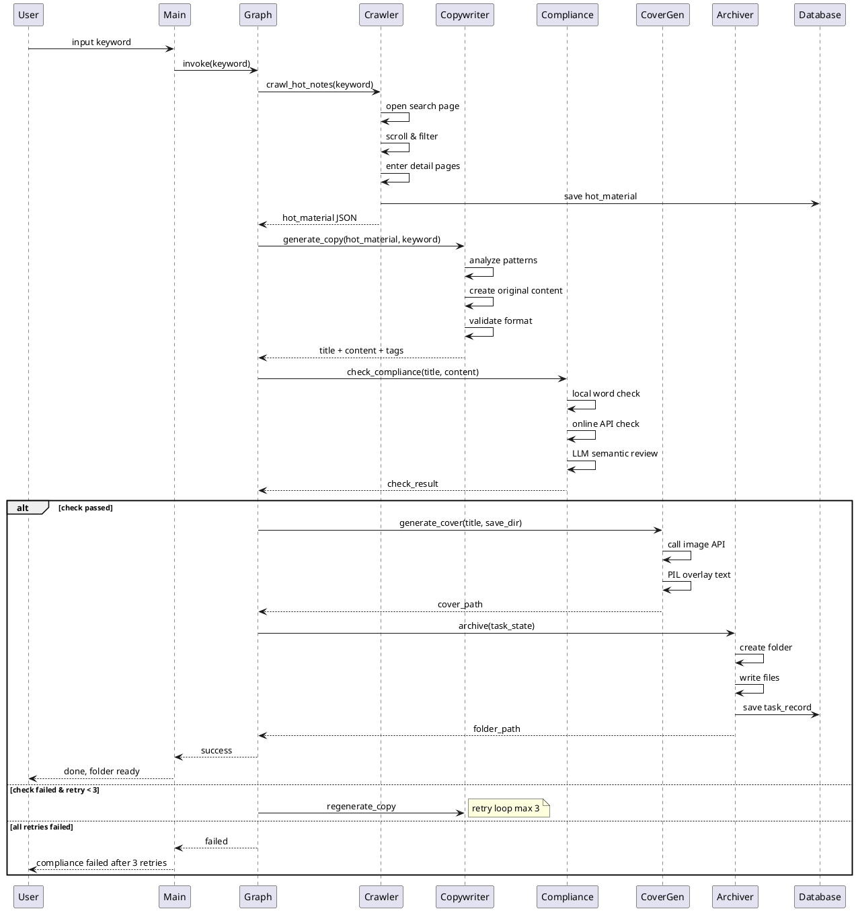
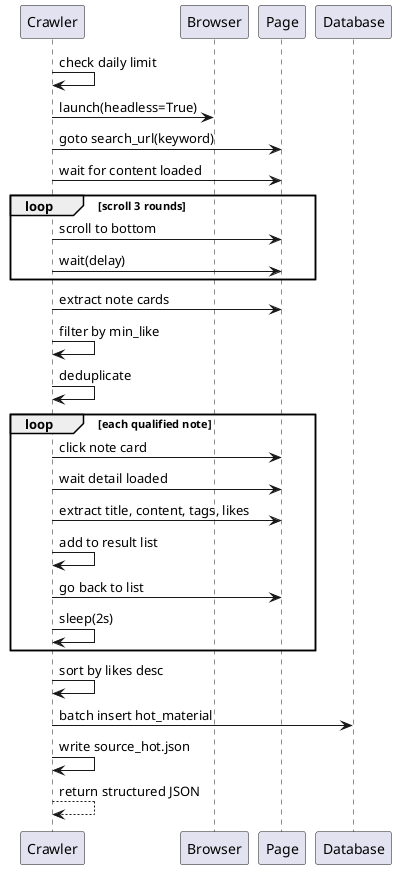
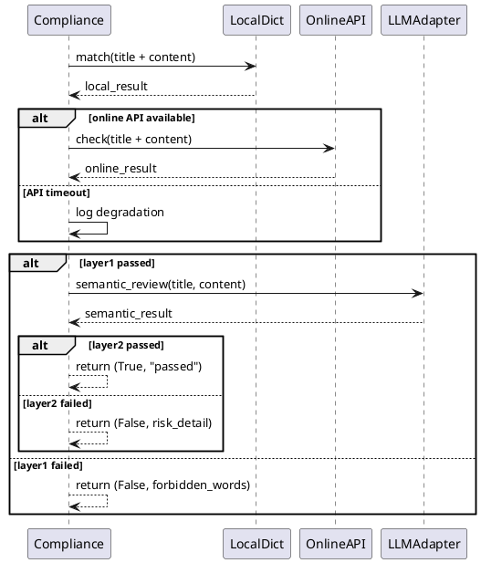
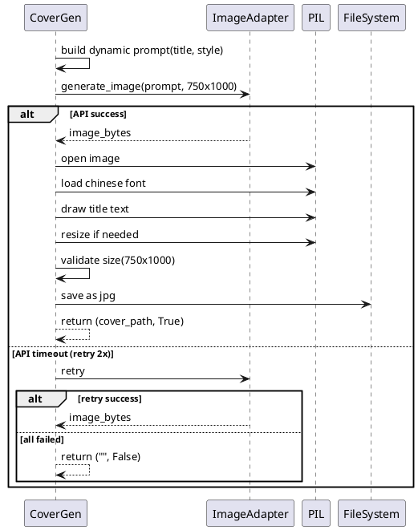

# 小红书AI内容智能体系统 — 技术设计文档

## 修改记录

| 版本 | 日期 | 作者 | 说明 |
|------|------|------|------|
| 1.0 | 2025-07-15 | honghui | 初稿 |

## 部署环境

| 项目 | 信息 |
|------|------|
| 服务器操作系统 | CentOS（仅部署非爬虫模块时） |
| 服务器 CPU 架构 | x86 |
| 信创授权 | 否 |
| 客户端操作系统 | Windows（主运行环境） |

---

## 目录

- 第1章: 模块功能设计
- 第2章: 关键流程设计
- 第3章: 数据库设计
- 第4章: 程序设计
- 第5章: 项目结构与配置

---

## 第1章: 模块功能设计

### 1.1 系统架构总览

系统采用 LangGraph 状态机智能体架构，分为四层：

```
┌─────────────────────────────────────────────────┐
│              调度层（LangGraph 状态机）            │
│    任务规划 · 流程跳转 · 条件分支 · 重试控制       │
├─────────────────────────────────────────────────┤
│              LLM 推理层（适配器模式）              │
│    文案创作 · 爆款分析 · 合规审核 · Prompt管理     │
├─────────────────────────────────────────────────┤
│              工具技能层（5大 Skill）               │
│    爬虫 · 文案生成 · 合规检测 · 封面生成 · 归档    │
├─────────────────────────────────────────────────┤
│              数据持久层                           │
│    SQLite · JSON文件 · 日志文件 · 素材文件夹       │
└─────────────────────────────────────────────────┘
```

### 1.2 模块交互关系

```
用户(CLI) ──→ main.py(入口) ──→ LangGraph调度器
                                      │
                    ┌─────────────────┼─────────────────┐
                    ▼                 ▼                  ▼
              爬虫Skill ──→ 文案生成Skill ──→ 合规检测Skill
                                                        │
                                          ┌─────────────┤
                                          ▼             ▼
                                    封面生成Skill   归档Skill
                                          │             │
                                          └──────┬──────┘
                                                 ▼
                                          本地文件+SQLite
```

### 1.3 模块职责

#### 1.3.1 基础设施层（REQ-001, REQ-009, REQ-010）

| 模块 | 职责 | 关键文件 |
|------|------|----------|
| 配置管理 | 统一管理 API Key、业务参数、路径配置 | config/settings.py |
| 日志系统 | 全流程日志记录，控制台+文件双输出 | utils/logger.py |
| 异常处理 | 统一异常捕获、重试装饰器 | utils/exceptions.py |
| 入口控制 | argparse 单次执行 + 交互循环 | main.py |

#### 1.3.2 数据持久层（REQ-002）

| 模块 | 职责 | 关键文件 |
|------|------|----------|
| 数据库管理 | SQLite 自动建表、CRUD 封装 | database/db_manager.py |
| 模型定义 | 数据表对应的 Python 数据类 | database/models.py |

#### 1.3.3 工具技能层（REQ-003 ~ REQ-007）

| 模块 | 职责 | 关键文件 |
|------|------|----------|
| 爬虫工具 | Playwright 采集小红书爆款笔记 | tools/crawler.py |
| 文案生成工具 | LLM 分析爆款 + 原创文案 | tools/copywriter.py |
| 合规检测工具 | 本地词库 + 在线接口 + LLM语义审核 | tools/compliance.py |
| 封面生成工具 | 绘图API生成底图 + PIL叠加文字 | tools/cover_generator.py |
| 归档工具 | 结构化文件夹输出 + 数据库落库 | tools/archiver.py |

#### 1.3.4 适配器层（REQ-004, REQ-005, REQ-006）

| 模块 | 职责 | 关键文件 |
|------|------|----------|
| LLM 适配器 | 统一 LLM 调用接口，支持豆包/通义千问切换 | adapters/llm_adapter.py |
| 绘图适配器 | 统一绘图 API 接口，支持通义万相/豆包绘图切换 | adapters/image_adapter.py |

#### 1.3.5 调度层（REQ-008）

| 模块 | 职责 | 关键文件 |
|------|------|----------|
| 状态定义 | AgentState 全局状态 TypedDict | agent/state.py |
| 节点函数 | 5大工具节点的 LangGraph 封装 | agent/nodes.py |
| 流程编排 | StateGraph 构建、条件分支、重试逻辑 | agent/graph.py |

---

## 第2章: 关键流程设计

### 2.1 主流程——智能体完整执行链路



### 2.2 爬虫采集流程



### 2.3 合规检测流程



### 2.4 封面生成流程



---

## 第3章: 数据库设计

### 3.1 数据库概述

- 数据库类型：SQLite 3
- 数据库文件：`data/xhs_agent.db`
- 自动建表：程序启动时检测并创建

### 3.2 表设计

#### 表1: task_record（任务记录表）

| 字段名 | 数据类型 | 默认值 | 说明 |
|--------|----------|--------|------|
| id | TEXT PRIMARY KEY | UUID | 任务唯一标识 |
| keyword | TEXT NOT NULL | '' | 生成关键词 |
| create_time | TEXT NOT NULL | '' | 创建时间（ISO格式） |
| title | TEXT NOT NULL | '' | 最终标题 |
| content | TEXT NOT NULL | '' | 最终正文 |
| tags | TEXT NOT NULL | '' | 标签（JSON数组字符串） |
| check_result | TEXT NOT NULL | '' | 合规检测结果 |
| cover_path | TEXT NOT NULL | '' | 封面图本地路径 |
| status | TEXT NOT NULL | '' | 任务状态：success/failed/pending |
| retry_count | INTEGER NOT NULL | 0 | 合规重试次数 |
| error_msg | TEXT NOT NULL | '' | 失败原因 |

#### 表2: hot_material（爆款素材库）

| 字段名 | 数据类型 | 默认值 | 说明 |
|--------|----------|--------|------|
| id | TEXT PRIMARY KEY | UUID | 素材唯一标识 |
| keyword | TEXT NOT NULL | '' | 搜索关键词 |
| ref_title | TEXT NOT NULL | '' | 原始笔记标题 |
| ref_content | TEXT NOT NULL | '' | 原始笔记正文 |
| ref_tags | TEXT NOT NULL | '' | 原始标签（JSON数组字符串） |
| like_num | INTEGER NOT NULL | 0 | 点赞数 |
| crawl_url | TEXT NOT NULL | '' | 原始笔记链接 |
| crawl_time | TEXT NOT NULL | '' | 采集时间（ISO格式） |
| task_id | TEXT NOT NULL | '' | 关联任务ID |

#### 表3: crawl_counter（采集计数器）

| 字段名 | 数据类型 | 默认值 | 说明 |
|--------|----------|--------|------|
| id | TEXT PRIMARY KEY | UUID | 记录唯一标识 |
| date | TEXT NOT NULL | '' | 日期（YYYY-MM-DD） |
| count | INTEGER NOT NULL | 0 | 当日已采集次数 |

### 3.3 DDL 脚本

见独立文件：`.ai/designs/sql/2025-07-15-xhs-ai-agent-ddl.sql`

---

## 第4章: 程序设计

### 4.1 核心数据结构

#### AgentState（全局状态）

```python
from typing import TypedDict, List, Optional

class AgentState(TypedDict):
    keyword: str              # 用户输入的赛道关键词
    hot_material: str         # 爬虫采集的爆款素材JSON
    title: str                # 生成的笔记标题
    content: str              # 生成的笔记正文
    tags: List[str]           # 生成的标签列表
    check_result: str         # 合规检测结果
    cover_path: str           # 封面图路径
    finished: bool            # 任务是否完成
    retry_count: int          # 合规重试计数
    error_msg: str            # 错误信息
    task_id: str              # 当前任务ID
```

### 4.2 适配器设计

#### LLM 适配器（策略模式）

```python
from abc import ABC, abstractmethod

class BaseLLMAdapter(ABC):
    """LLM 统一调用接口"""
    
    @abstractmethod
    def chat(self, system_prompt: str, user_prompt: str) -> str:
        """发送对话请求，返回模型回复文本"""
        pass

class DoubaoAdapter(BaseLLMAdapter):
    """豆包（字节）模型适配器"""
    pass

class QwenAdapter(BaseLLMAdapter):
    """通义千问（阿里）模型适配器"""
    pass
```

#### 绘图适配器（策略模式）

```python
class BaseImageAdapter(ABC):
    """绘图 API 统一调用接口"""
    
    @abstractmethod
    def generate(self, prompt: str, width: int, height: int) -> bytes:
        """生成图片，返回图片二进制数据"""
        pass

class WanxiangAdapter(BaseImageAdapter):
    """通义万相适配器"""
    pass

class DoubaoImageAdapter(BaseImageAdapter):
    """豆包绘图适配器"""
    pass
```

### 4.3 LangGraph 状态机编排

```python
from langgraph.graph import StateGraph, END

def build_graph() -> StateGraph:
    graph = StateGraph(AgentState)
    
    # 注册节点
    graph.add_node("crawl", crawl_node)
    graph.add_node("generate_copy", generate_copy_node)
    graph.add_node("compliance_check", compliance_check_node)
    graph.add_node("generate_cover", generate_cover_node)
    graph.add_node("archive", archive_node)
    
    # 定义边
    graph.set_entry_point("crawl")
    graph.add_edge("crawl", "generate_copy")
    graph.add_edge("generate_copy", "compliance_check")
    
    # 条件分支：合规检测后
    graph.add_conditional_edges(
        "compliance_check",
        compliance_router,  # 路由函数
        {
            "passed": "generate_cover",
            "retry": "generate_copy",
            "failed": END
        }
    )
    
    graph.add_edge("generate_cover", "archive")
    graph.add_edge("archive", END)
    
    return graph.compile()
```

### 4.4 重试机制设计

```python
def compliance_router(state: AgentState) -> str:
    """合规检测路由：决定下一步走向"""
    if state["check_result"] == "passed":
        return "passed"
    elif state["retry_count"] < 3:
        return "retry"
    else:
        return "failed"
```

### 4.5 工具函数签名

| 工具 | 函数签名 | 说明 |
|------|----------|------|
| 爬虫 | `crawl_hot_notes(keyword, min_like, max_note, wait_delay) -> List[dict]` | 采集爆款笔记 |
| 文案 | `generate_copy(hot_material, keyword, word_count_range) -> dict` | 生成原创文案 |
| 合规 | `check_compliance(title, content) -> dict` | 双层合规检测 |
| 封面 | `generate_cover(title, save_dir, style) -> dict` | 生成封面图 |
| 归档 | `archive_task(task_state) -> dict` | 归档素材包 |

### 4.6 异常处理与重试装饰器

```python
import functools
import time

def retry(max_retries: int = 2, timeout: float = 5.0):
    """统一重试装饰器"""
    def decorator(func):
        @functools.wraps(func)
        def wrapper(*args, **kwargs):
            for attempt in range(max_retries + 1):
                try:
                    return func(*args, **kwargs)
                except TimeoutError:
                    if attempt == max_retries:
                        raise
                    time.sleep(1)
            return None
        return wrapper
    return decorator
```

### 4.7 配置管理设计

```python
# config/settings.py
from pydantic_settings import BaseSettings

class Settings(BaseSettings):
    # API Keys
    doubao_api_key: str = ""
    doubao_model_id: str = ""
    qwen_api_key: str = ""
    wanxiang_api_key: str = ""
    
    # LLM 选择
    llm_provider: str = "doubao"  # doubao / qwen
    image_provider: str = "wanxiang"  # wanxiang / doubao
    
    # 爬虫配置
    crawler_min_like: int = 800
    crawler_max_note: int = 10
    crawler_wait_delay: int = 2000
    crawler_mode: str = "no_login"  # no_login / cookie
    crawler_cookie: str = ""
    crawler_daily_limit: int = 5
    
    # 文案配置
    copy_word_min: int = 300
    copy_word_max: int = 800
    
    # 路径配置
    output_dir: str = "./output"
    db_path: str = "./data/xhs_agent.db"
    font_path: str = "./assets/fonts/SourceHanSansCN-Regular.otf"
    
    class Config:
        env_file = ".env"
        env_file_encoding = "utf-8"
```

---

## 第5章: 项目结构与配置

### 5.1 项目目录结构

```
xhs/
├── main.py                     # 程序入口（argparse + 交互循环）
├── requirements.txt            # Python 依赖清单
├── .env.example                # 环境变量模板
├── .env                        # 实际环境变量（不入库）
├── .gitignore
│
├── config/
│   ├── __init__.py
│   └── settings.py             # 全局配置类（Pydantic Settings）
│
├── agent/
│   ├── __init__.py
│   ├── state.py                # AgentState 定义
│   ├── nodes.py                # 5大节点函数
│   └── graph.py                # LangGraph 状态机构建
│
├── adapters/
│   ├── __init__.py
│   ├── llm_adapter.py          # LLM 统一适配器（豆包/通义千问）
│   └── image_adapter.py        # 绘图 API 统一适配器
│
├── tools/
│   ├── __init__.py
│   ├── crawler.py              # 小红书爆虫工具
│   ├── copywriter.py           # 爆款分析+原创文案生成
│   ├── compliance.py           # 双层合规检测
│   ├── cover_generator.py      # AI封面生成+PIL文字叠加
│   └── archiver.py             # 本地智能归档
│
├── database/
│   ├── __init__.py
│   ├── db_manager.py           # SQLite 连接管理+CRUD
│   └── models.py               # 数据模型定义
│
├── utils/
│   ├── __init__.py
│   ├── logger.py               # 全局日志系统
│   └── exceptions.py           # 统一异常定义+重试装饰器
│
├── assets/
│   ├── fonts/
│   │   └── SourceHanSansCN-Regular.otf  # 开源中文字体
│   └── forbidden_words.txt     # 本地极限词库
│
├── data/
│   └── xhs_agent.db            # SQLite 数据库文件（自动创建）
│
└── output/                     # 成品输出根目录
    └── YYYYMMDD_关键词_标题/
        ├── 文案.txt
        ├── 封面.jpg
        ├── source_hot.json
        └── log.txt
```

### 5.2 依赖清单（requirements.txt）

```
langchain>=0.2.0
langgraph>=0.1.0
langchain-openai>=0.1.0
playwright>=1.40.0
pillow>=10.0.0
requests>=2.31.0
python-dotenv>=1.0.0
pydantic-settings>=2.0.0
```

### 5.3 .env.example 模板

```env
# === LLM 配置 ===
DOUBAO_API_KEY=your_doubao_api_key_here
DOUBAO_MODEL_ID=your_model_endpoint_id
QWEN_API_KEY=your_qwen_api_key_here

# === 绘图 API ===
WANXIANG_API_KEY=your_wanxiang_api_key_here
DOUBAO_IMAGE_API_KEY=your_doubao_image_key_here

# === 服务选择 ===
LLM_PROVIDER=doubao
IMAGE_PROVIDER=wanxiang

# === 爬虫配置 ===
CRAWLER_MODE=no_login
CRAWLER_COOKIE=
CRAWLER_MIN_LIKE=800
CRAWLER_MAX_NOTE=10
CRAWLER_WAIT_DELAY=2000
CRAWLER_DAILY_LIMIT=5

# === 文案配置 ===
COPY_WORD_MIN=300
COPY_WORD_MAX=800

# === 路径配置 ===
OUTPUT_DIR=./output
DB_PATH=./data/xhs_agent.db
FONT_PATH=./assets/fonts/SourceHanSansCN-Regular.otf
```

### 5.4 技术决策摘要

| 决策点 | 选择 | 理由 |
|--------|------|------|
| 智能体框架 | LangGraph | 状态机模式，可控、可重试、适合流水线 |
| LLM 框架 | LangChain | 统一对接多模型，生态成熟 |
| 配置管理 | Pydantic Settings | 类型安全、支持 .env、有默认值 |
| 数据库 | SQLite | 本地轻量、无需安装、零配置 |
| 爬虫 | Playwright | 真实浏览器渲染、支持反反爬 |
| 图像处理 | Pillow | 轻量、支持文字叠加、开源 |
| 适配器模式 | ABC 抽象类 | 统一接口、配置切换、易扩展 |
| 中文字体 | 思源黑体 | 开源免费、效果好、覆盖全 |

